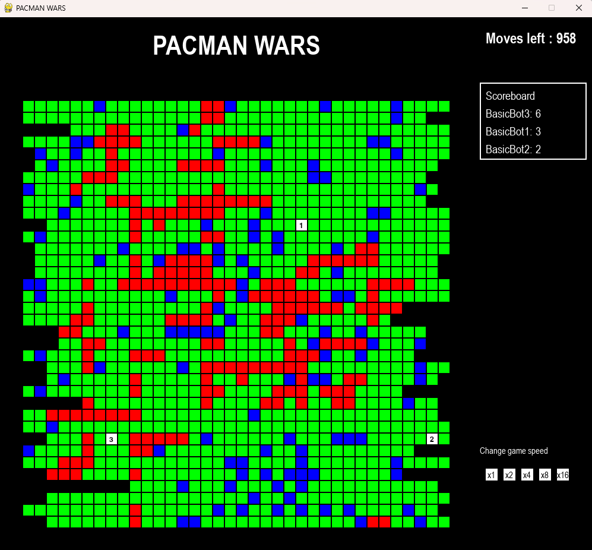

# PacmanWars
**Do you think you have what it takes to beat all the other players ?**

PacmanWars is a game where multiple bots compete in a grid-based environment to collect food and survive. If you want to fight in this game, you can fork the repo and submit the code of your own bot. 



## How to submit your custom bots

To create a custom bot, follow these steps:

1. Create a new Python file in the [bots](http://_vscodecontentref_/8) directory with any valid name.
2. Define a new class that inherits from the `Bot` class (Keep the class name as your github username).
3. Implement the **move** method.
4. See the reference bots **basic_bot1.py** and **basic_bot2.py**.
5. Use this reference code below to write your new bot.

Example:
```python
from bots.bot import Bot

class CustomBot(Bot):
    def __init__(self, id: int, start_x: int, start_y: int, minimap: list, map_length: int, map_breadth: int):
        super().__init__(id, start_x, start_y, minimap, map_length, map_breadth)

    def move(self, current_x, current_y, minimap, bot_food):
        self.update_state(current_x, current_y, minimap, bot_food)
        # Implement your bot's strategy here
        return direction
```

## Features

- Randomly generated game map with obstacles and food
- Multiple bots with unique behaviors coded by different people
- Real-time scoreboard
- Customizable bot strategies

## Installation

1. Clone the repository:
    ```sh
    git clone https://github.com/xzaviourr/PacmanWars.git
    cd PacmanWars
    ```

2. Create a virtual environment and activate it:
    ```sh
    python -m venv pacmanwars-env
    pacmanwars-env\Scripts\activate  # On Windows
    source pacmanwars-env/bin/activate  # On macOS/Linux
    ```

3. Install the required dependencies:
    ```sh
    pip install -r requirements.txt
    ```

## Usage

1. Run the game:
    ```sh
    python main.py
    ```

2. Watch the bots compete and collect food. The scoreboard on the right side of the screen shows the current standings.

## Project Structure

- [main.py](http://_vscodecontentref_/1): The main entry point for the game.
- [constants.py](http://_vscodecontentref_/2): Contains game constants and configurations.
- [map_generator.py](http://_vscodecontentref_/3): Generates the game map.
- [food_generator.py](http://_vscodecontentref_/4): Generates food on the map.
- [bot_operations.py](http://_vscodecontentref_/5): Contains functions for bot movements and interactions.
- [bots](http://_vscodecontentref_/6): Directory containing bot implementations.
- [readme.md](http://_vscodecontentref_/7): This file.

## How to play the game
This is a last man standing game. **Your bot needs to kill all the other bots to win the game**. To kill any other bot, your bot needs to cross that bot or be in the same cell as the other bot. When two or more bots are in the same cell, bot with the maximum amount of food wins the battle and collect food from all the dead bots.

Food will keep on spawning across the map. In each turn bot can move in either of the 4 directions or does not move at all. Bots can collect food from the food cells (Blue colored). Bots cannot move in the red (MOUNTAIN_CELL) and black (OUT_OF_BOUNDS_CELL) cells. After each turn, bot will be provided with a **5x5 minimap** based on which the bot needs to decide its next move. 

Types of cells -
- WALKABLE CELL : Green colored, bot can move in this
- FOOD CELL : Blue colored, bot can move into this cell and eat the food
- MOUNTAIN CELL : Red colored, bot cannot move in this cell
- OUT_OF_BOUNDS_CELL : Black colored, these are not part of the map
- Numbered cell : Other bot is standing in this cell

Types of bot movement -
- MOVE_LEFT : bot moves 1 cell to the left
- MOVE_RIGHT : bot moves 1 cell to the right
- MOVE_UP : bot moves 1 cell up
- MOVE_DOWN : bot moves 1 cell down
- MOVE_HALT : bot does not move